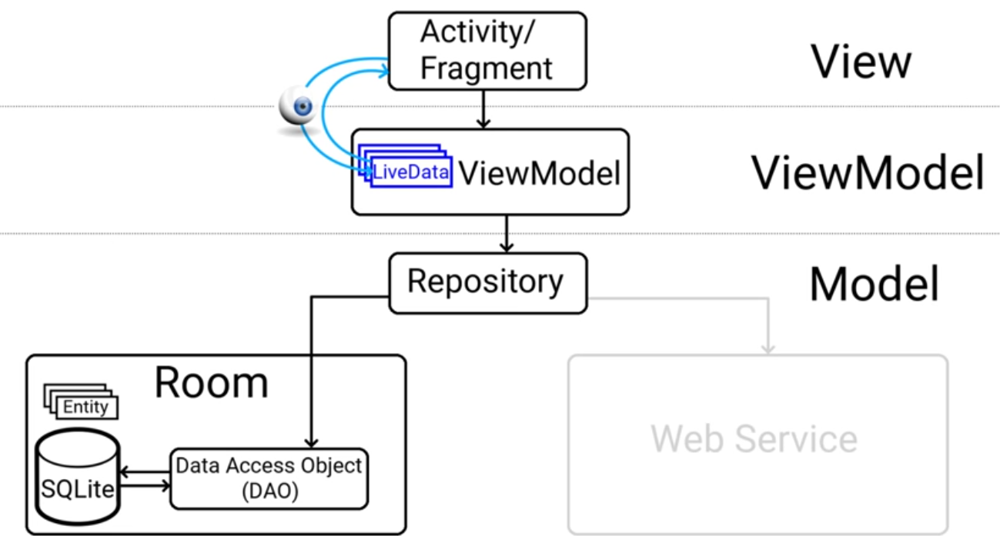
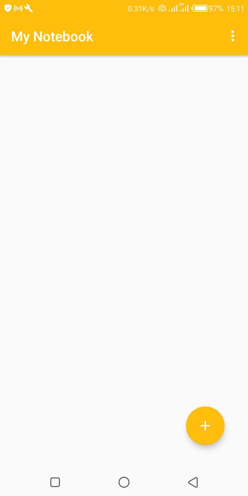
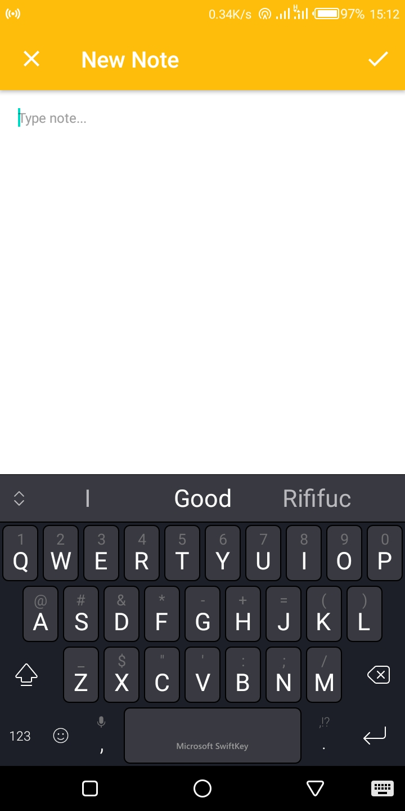
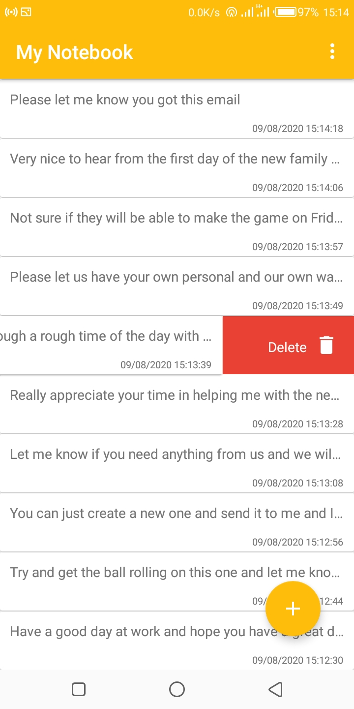
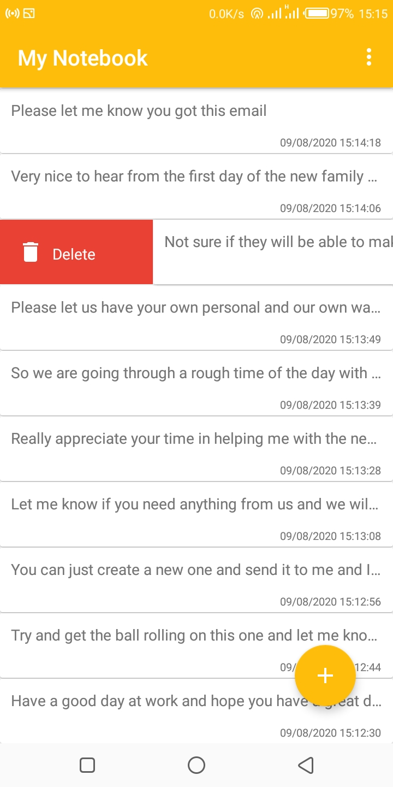
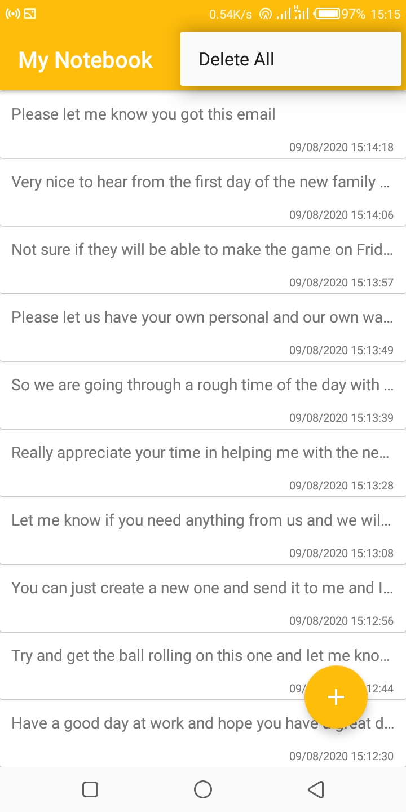

<p align="center">


# Temporary Diary

An android application to save short notes, built with clean architecture principles, Repository Pattern and MVVM
pattern as well as Architecture Components.

Min Api Level : 19 


## Table of Contents

- [Libraries](#libraries)
- [Contributors](#contributors)
- [Demo](#demo)
- [Support](#support)
- [References](#references)


## Setup Requirements

- Android device or emulator
- Android Studio

## Getting Started

In order to get the app running yourself, you need to:

1.  clone this project
2.  Import the project into Android Studio
3.  Connect the android device with USB or just use your emulator
4.  In Android Studio, click on the "Run" button.

## Libraries

Libraries used in the whole application are:

- [Jetpack](https://developer.android.com/jetpack)🚀
- [Viewmodel](https://developer.android.com/topic/libraries/architecture/viewmodel) - Manage UI related data in a lifecycle conscious way 
  and act as a channel between use cases and ui
- [Room](https://developer.android.com/training/data-storage/room) - Provides abstraction layer over SQLite
- [Material Design](https://material.io/develop/android/docs/getting-started/) - build awesome beautiful UIs.🔥🔥
- [RecyclerView Swipe Decorator](https://github.com/wasabeef/recyclerview-animators) - Swipe to delete animator

## Pattern


## Demo

<p float="left">


  
  
  
  
  
  </p>

## Contributors

- Thanks to [Coding in Flow](https://codinginflow.com/) for amazing tutorial on the MVVM and android architectural components

## References

- https://material.io/develop/android/components/navigation-view/
- https://codinginflow.com/

## License

 ```
   Copyright 2020 Temporary Diary
   
   Licensed under the Apache License, Version 2.0 (the "License");
   you may not use this file except in compliance with the License.
   You may obtain a copy of the License at

       http://www.apache.org/licenses/LICENSE-2.0

   Unless required by applicable law or agreed to in writing, software
   distributed under the License is distributed on an "AS IS" BASIS,
   WITHOUT WARRANTIES OR CONDITIONS OF ANY KIND, either express or implied.
   See the License for the specific language governing permissions and
   limitations under the License.
